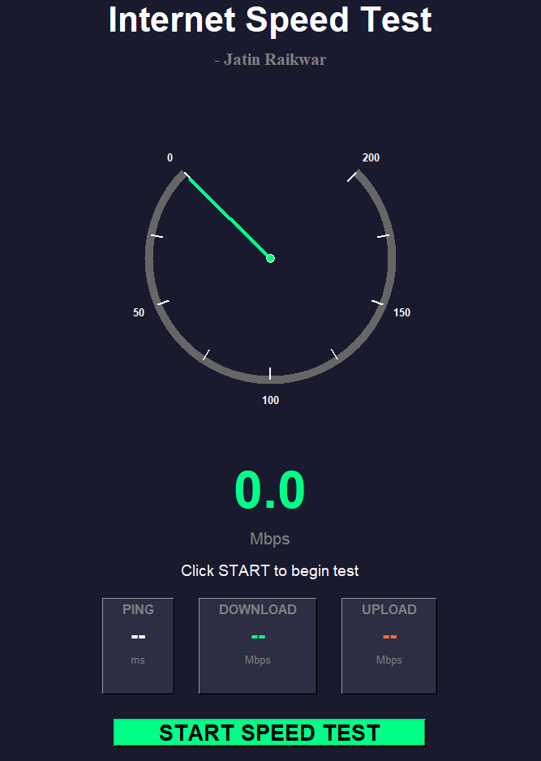

# Internet Speed Test App

 <!-- Add a screenshot of your app here -->

A **Python-based GUI application** to test your internet speed in real-time. This app provides **download, upload, and ping metrics** along with a visually appealing **speedometer animation**. Built with `Tkinter` and `speedtest-cli`, it offers an interactive and modern interface for checking your network performance.

---

## Features

- Real-time **speedometer animation** for download and upload speeds.
- Displays **Ping, Download, and Upload** values in a clean UI.
- Animated needle and live speed updates for an engaging experience.
- Multi-threaded testing to keep the UI responsive.
- Easy-to-use interface with a single **Start Test** button.

---

## Technologies Used

- **Python 3**
- **Tkinter** for GUI
- **speedtest-cli** for network speed measurement
- **Threading** for smooth UI performance
- **Math and Random modules** for needle animation and speed simulation

---

## Installation

1. **Clone the repository:**

```bash
git clone https://github.com/yourusername/internet-speed-test.git
cd internet-speed-test


